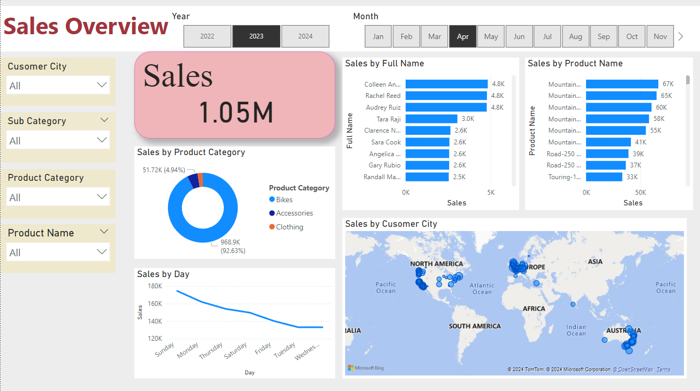

# AdventureWorks Sales Report & Twitter Sentiment Analysis

## Overview
This project includes two main tasks:
1. **AdventureWorks Sales Report**: Provides insights into the sales performance of AdventureWorks, highlighting key metrics such as total sales count, product categories, individual product sales, customer details, and time-based classifications.
2. **Twitter Sentiment Analysis**: Analyzes the sentiment of tweets related to specific topics (e.g., COVID-19) using Python, generating a sentiment graph to visualize the polarity of the emotions expressed.

The report and analysis are designed to assist in making informed business decisions and understanding social media sentiment trends.

---

## 1) **AdventureWorks Sales Report**

### 1. Total Sales Count
This section provides a high-level overview of the total number of sales transactions recorded in the AdventureWorks dataset. The total sales count gives a quick snapshot of the overall sales volume.

### 2. Sales by Product Category
This part of the report breaks down sales into broader product categories. By analyzing product categories, we can identify which categories are performing best and contributing the most to overall revenue.

### 3. Sales by Product Name
In this section, sales are further detailed by individual product names. This helps pinpoint which specific products are the best sellers, providing valuable insights into product demand.

### 4. Sales by Customer Full Name
Here, sales data is segmented by customer names. This view helps in identifying high-value customers and understanding customer-specific sales patterns.

### 5. Sales by Day (Daily Sales Chart)
This chart visualizes the daily sales performance over a specific period. It allows for the identification of sales trends and seasonality, helping to determine peak sales days and periods of low activity.

### 6. Sales by Customer City
This section highlights sales performance by geographic location, specifically customer cities. Understanding regional sales can help with market expansion and targeting efforts.

### 7. Monthly and Yearly Sales Classification
This time-based classification breaks down sales by month and year. It is useful for detecting annual growth trends, seasonal patterns, and comparing month-over-month performance.

---

### Sales Report Screenshot

---

## 2) **Twitter Sentiment Analysis**

### Overview of Twitter Sentiment Analysis
The second task in this project involves performing sentiment analysis on tweets fetched from a public source. We use Python and the VADER (Valence Aware Dictionary and sEntiment Reasoner) sentiment analysis tool to evaluate the sentiment polarity—positive, negative, and neutral.

### Sentiment Analysis Workflow
1. **Scrape Tweets**: Tweets related to specific search terms (e.g., "COVID-19") are scraped using Python's `requests` and `BeautifulSoup`.
2. **Clean and Process Data**: The tweets are cleaned by removing punctuation, stopwords, and tokenizing the text.
3. **Perform Sentiment Analysis**: The processed tweets are analyzed using VADER to classify them into positive, negative, and neutral sentiments.
4. **Graphical Representation**: Sentiment scores are visualized using a bar chart, which gives an overview of the sentiment distribution.

---

### Sentiment Analysis Graph

---

## Usage of Sentiment Analysis
This sentiment analysis can be useful for:
- **Tracking public opinion** on current events or brands.
- **Understanding customer sentiment** from social media platforms like Twitter.
- **Analyzing trends** to inform marketing or customer service strategies.

## Data Source
- **AdventureWorks Sales Data**: The sales report data is sourced from the AdventureWorks dataset, which contains detailed transactional data for various sales activities.
- **Twitter Data**: Publicly available tweets from Google search are used for sentiment analysis.

## Conclusion
This project offers a dual perspective by combining business sales data insights with social sentiment analysis, providing businesses with actionable insights to make informed decisions in both the sales and marketing domains.
